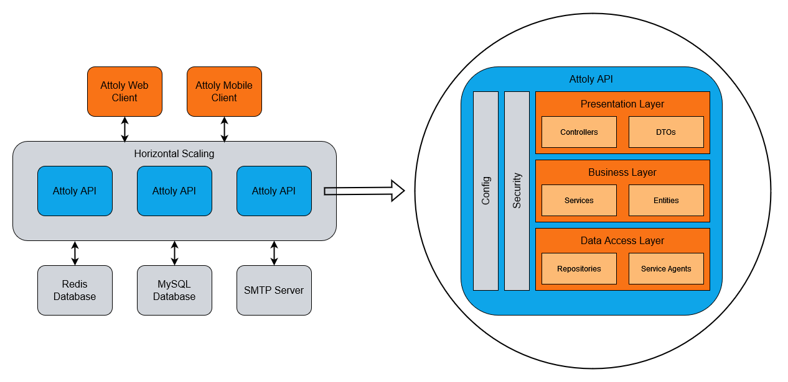

# Attoly API

> Data management and programming interface for the Attoly URL shortener platform.

## Table of contents

- [Introduction](#introduction)
- [Architecture](#architecture)
- [Deployment](#deployment)
- [License](#license)
  - [Forbidden](#forbidden)

## Introduction

This is the backend of the Attoly URL shortener platform, responsible for data storage and exchange.
Attoly allows creating short links as aliases for long URLs, which are easier to embed in websites,
chats and documents. Originally, the Attoly Platform is a learning project to gain experience in
distributed systems, user management, and cloud deployment. Therefore there are no claims to maintenance,
freedom from errors or further development. Further development only occurs as part of the learning process.

## Architecture

The Attoly platform is a distributed system. The Attoly API Service therefore only provides the backend
of the platform. It is a monolithic 3-layer architecture which is geared towards the horizontal scaling
of the service. The application is divided into the layers of presentation, business logic and data
management. The presentation layer essentially consists of an HTTP RESTful interface for machine-to-machine
interaction with the outsourced frontend. This interface is documented in OpenAPI format and stored
[here](src/main/resources/public/docs/v1/openapi.yml). Alternatively, the documentation can also be viewed
as a webpage via the self-service. The middle layer is the business layer, which essentially contains the
business logic in the form of services. The third and last layer is the data access layer, which is
responsible for data storage and event sourcing. The databases are accessed via repositories or data access
objects (DAO).

The Attoly API also uses various third-party services, including but not limited to databases. Attoly uses a
relational database, by default a MySQL database, for storing entities and a NoSQL Redis database for storing
temporary information like tokens. For individual processes, such as verifying user accounts, it is necessary
to send e-mails. An SMTP server must be configured for this, which Attoly uses for this purpose.

## Deployment

Deployment can be done via Docker or standalone. Information on this can be found under
[deployment](docs/deployment.md). The configuration options of the application are also important for deployment
and development. You can find it under [configuration](docs/configuration.md).

## License

Copyright (c) 2022 0x1C1B

Permission is hereby granted, free of charge, to any person obtaining a copy
of this software and associated documentation files (the "Software"), to deal
in the Software without restriction, including without limitation the rights
to use, copy, modify, merge, publish, distribute, sublicense, and/or sell
copies of the Software, and to permit persons to whom the Software is
furnished to do so, subject to the following conditions:

The above copyright notice and this permission notice shall be included in all
copies or substantial portions of the Software.

THE SOFTWARE IS PROVIDED "AS IS", WITHOUT WARRANTY OF ANY KIND, EXPRESS OR
IMPLIED, INCLUDING BUT NOT LIMITED TO THE WARRANTIES OF MERCHANTABILITY,
FITNESS FOR A PARTICULAR PURPOSE AND NONINFRINGEMENT. IN NO EVENT SHALL THE
AUTHORS OR COPYRIGHT HOLDERS BE LIABLE FOR ANY CLAIM, DAMAGES OR OTHER
LIABILITY, WHETHER IN AN ACTION OF CONTRACT, TORT OR OTHERWISE, ARISING FROM,
OUT OF OR IN CONNECTION WITH THE SOFTWARE OR THE USE OR OTHER DEALINGS IN THE
SOFTWARE.

[MIT License](https://opensource.org/licenses/MIT) or [LICENSE](LICENSE) for
more details.

### Forbidden

**Hold Liable**: Software is provided without warranty and the software
author/license owner cannot be held liable for damages.